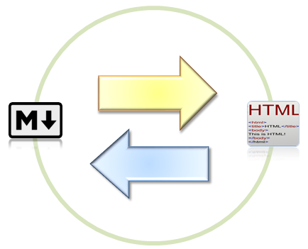

Mark Down Converter
===========
**Markdown Converter** is for translating '.md' file to various types of file. It will convert Markdown to HTML, SLIDE HTML, etc.
- - - -
###How To Use?

__A Jar file(md_html.jar)__ is a tool for Markdown Converter.
In this program, basically we call '.md' file, and decide conversion type, Output's name, Output's style, and Where we saves. Now, our steps of developing is not enough for showing all options. Basically we design converter **'.md' -> '.html'**

```
1. When executing through ant build script :
  a. Enter ‘Markdown-to-HTML-master’ directory using CMD, and check the existence of ‘build.xml’. 
  b. Compile java files using commands ‘ant’.
  c. Make jar file for running. Our ant command is ‘ant make_jar’
  d. Change directory for running file. We decided location of jar file in ‘lib’ directory. ‘cd lib.’
  e. Run jar file with right arguments that already defined. Our jar file’s name is md_html.jar. 
  java -jar md_html.jar {input_file} [options]
  ex) java -jar md_html.jar README.md
     java -jar md_html.jar ../README.md -o result -f html -d ../ -s plain
     java -jar md_html.jar -h
   
2. When executing through eclipse Java compiler
  : Run with necessary arguments given for the options
```
- - - -

##Tool's Command:
```
mdconverter (-h) 
            {input_file}
            {input_file} [options]
```
examples)
```
Readme.md -o hello            (o)
Hongshin.md -o                (x - No argument)
Hongshin.md                   (o - Default)
-h                            (o - Call help)
Hongshin.md -h                (x - Wrong Option)
Readme.md -o hello -f html    (o)
```
   * (-h): Show help messages. mdconverter -h.
```
***********Markdown Converter**********
mdconverter (-h)
            {input_file}
            {input_file} [options]      
***************************************
(-h): Show help message.

{input_file}: Input file's name. You can add name extension ".md" or not. But this program only find '.md' File.
              If computer does not find input file, it will send error message.
              If you put only {input_file}, "{input_file}.html" file will be made (same name, but '.html').

[options]: 
        -o  (filename) : Make html file which name is <filename>.
                         We do not allow file's name extension. You can decide file's type(format) using '-f'
        -f  (format)   : Decide output's format type. Only '.html' is allowed in this version.
        -s  (style)    : Decide output's style type (plain, fancy, slide). Only 'lower case' is allowed in (style). 
                         If style is plain, '(filename).html' will be made, any others,
                        '(filename)_(style).html' will be made.
        -d  (direction): Decide where will you put the file. You can decide directory address.
                         End of address, you can add '\' or not. Both are allowed.
       ---------- Shortkut Key Usage ----------           
       This is for shortkut key.
        -1 : Command 1 
        -2 : Command 2
        -3 : Command 3
```
   * {input_file}: Input File's name. If file does not exist, it will send error message. If user put only {input_file}, '{input_file}.html' will be made in same directory.
   * [options]: Choose options for converting '.md' file. This options does not impact by ordering. User can use both 'Upper' and 'Lower' case in options. But do not allow no arguments.(ex, only '-o', '-f' with no arguments.).
```
-o   (filename) : Make html file which name is decided by user. Do not allow file's extension.
-f   (format)   : Decide output's format type. Only '.html' is allowed in this version.
-s   (style)    : Decide output's style type (plain, fancy, slide). Only 'lower case' is allowed in (style).
                  If style is plain, '(filename).html' will be made, any others, 
                  '(filename)_(style).html' will be made.
-d   (direction): Decide where will you put the file. You can decide directory address.
                  End of address, you can add '\' or not. Both are allowed.
-1              : Command 1
-2              : Command 2
-3              : Command 3
```

----------
 __Caution__: Basically tool searches file in 'Tool's directory'. And if there is a same output's name in same directory, this tool will ask you a question that overwrite or not. if you put 'y or Y' command, it will overwrite, if you put 'n' or 'N' command, it will not overwrite and terminate. 
 
_Handong Global University.
Software Engineering Term project first assignment.
Group S_
